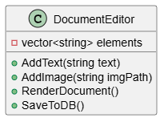
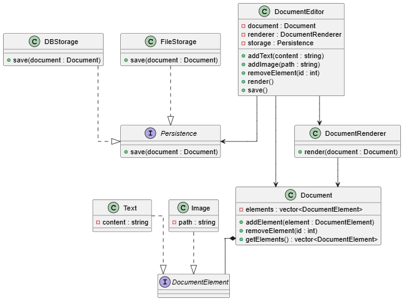

# Design Google Docs

## 1. Problem Statement
Implement a google docs application that, for now, has features of adding and removing text and image elements, rendering them and saving the document, but may scale to more formatting, and other elements also in the future.

## 2. Requirements

### 2.1 Functional Requirements

- Add text
- Add image
- Render document
- Save document

### 2.2 Non-Functional Requirements

- Maintainability: The system should be easy to maintain and extend.
- Extensibility: The system should be designed in a way that allows for easy addition of new features.

## 3. System Design

### 3.1 Initial Design

**Thought Process:** A simple document editor class will contain a list of elements (text and images). A single class will have all the functionalities of adding, removing and rendering the elements of the document.

**UML Diagram:**

**Drawbacks:**
- The class will become large and difficult to maintain as more features are added. Problem of "God Class" arises.
- Violates the Single Responsibility Principle (SRP) as it handles multiple responsibilities.
- Lack of flexibility in adding new types of elements (e.g., tables, videos) in the future.
- Violates the Open/Closed Principle (OCP) as adding new features would require modifying the existing class.
- Violates the Liskov Substitution Principle (LSP) as it may not be possible to substitute a new element type without changing the existing code.
- Violates the Interface Segregation Principle (ISP) as clients may be forced to depend on methods they do not use.
- Violates the Dependency Inversion Principle (DIP) as high-level modules depend on low-level modules.

### 3.2 Refined Design

**Thought Process:** To address the drawbacks of the initial design, we can refactor the code to follow SOLID principles. We can create separate classes for different types of elements (text and image) and use an interface to define common behaviors. The document editor class will then manage a collection of these elements. Also, document renderer functionality can be separated into its own class to adhere to the Single Responsibility Principle. Future elements can be added by creating new classes that implement the common interface, without modifying existing code.

**UML Diagram:**

**Classes and Entities:**
- **Document**: Represents the document and contains a collection of elements.
- **DocumentEditor**: Manages a collection of elements and provides methods to add, remove, and render them.
- **DocElement (Interface)**: Defines common behaviors for all elements (e.g., text, img, videos, tables, etc.).
- **DocumentRenderer**: Responsible for rendering the document by iterating through the collection of elements and rendering each one.
- **Persistence (abstract class)**: Responsible for saving the document to a file, database or any other storage method.
